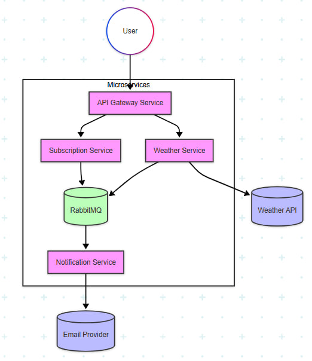

Language: PHP (Symfony framework and Doctrine ORM)
Storage: PostgresSQL
Service communication: RabbitMQ
Weather API: [WeatherAPI](https://www.weatherapi.com)
## Installation

### 1. Clone repository
```bash
git clone https://github.com/ihorbayrak/weather-api.git
```

### 2. Run command

```bash
sh start-app.sh
```

This command will install dependencies and create following containers to run this application:

### 3. Using application

## Architecture


### Fetch weather

- **Endpoint:** [http://localhost:8001/api/weather](http://localhost:8001/api/weather)
- **Method:** `GET`
- **Query Parameters:**
    - `city` (required, type: `string`): The name of the city.

- **Responses:**
    - `200`: Successful operation. Returns:
        - `temperature` (number): Current temperature.
        - `humidity` (number): Current humidity percentage.
        - `description` (string): Weather description.
    - `400`: Invalid request.
    - `404`: City not found.

---

### Subscribe

- **Endpoint:** [http://localhost:8001/api/subscribe](http://localhost:8001/api/subscribe)
- **Method:** `POST`

- **Form Data Parameters:**
    - `email` (required, type: `string`): Email address to subscribe.
    - `city` (required, type: `string`): City to receive weather updates for.
    - `frequency` (required, type: `string`): Update frequency. One of:
        - `hourly`
        - `daily`

- **Responses:**
    - `200`: Subscription successful. Confirmation email sent.
    - `400`: Invalid input.
    - `409`: Email already subscribed.

---

### Confirm Email

- **Endpoint:** [http://localhost:8001/api/confirm/{token}](http://localhost:8001/api/confirm/{token})
- **Method:** `GET`

- **Path Parameter:**
    - `token` (required, type: `string`): Token from confirmation email.

- **Responses:**
    - `200`: Subscription confirmed successfully.
    - `400`: Invalid token.
    - `404`: Token not found.

---

### Unsubscribe

- **Endpoint:** [http://localhost:8001/api/unsubscribe/{token}](http://localhost:8001/api/unsubscribe/{token})
- **Method:** `GET`

- **Path Parameter:**
    - `token` (required, type: `string`): Token from unsubscribe link.

- **Responses:**
    - `200`: Unsubscribed successfully.
    - `400`: Invalid token.
    - `404`: Token not found.

## Tests
There are implemented unit tests for weather fetching. In the future, I'll cover all functionality with unit tests